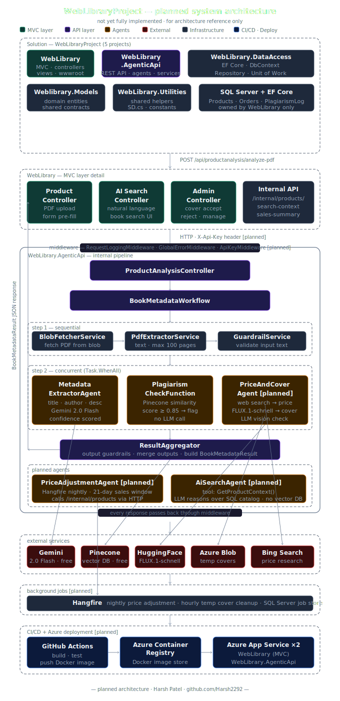

# Architecture

> This document covers the full planned architecture of the WebLibraryProject system — both what is currently built and what is planned. Sections and features marked **[planned]** are not yet implemented.

---

## System diagram



> Diagram shows the full **planned** architecture. See [README.md](./README.md) for what is currently implemented.

---

## Solution overview

WebLibraryProject is a five-project .NET solution where an ASP.NET Core MVC bookstore delegates all AI work to a dedicated REST API. The two runnable projects communicate over HTTP. The MVC project owns all user-facing functionality and the database. The Agent API owns all AI logic and has no direct database access.

```
Solution: WebLibraryProject
│
├── WebLibrary              ASP.NET Core MVC — bookstore UI and admin
├── WebLibrary.AgenticApi   ASP.NET Core Web API — multi-agent AI pipeline
├── WebLibrary.DataAccess   Class Library — EF Core, DbContext, Repository, UoW
├── Weblibrary.Models       Class Library — domain entities, shared contracts
└── WebLibrary.Utilities    Class Library — shared constants, helpers, SD.cs
```

```
WebLibrary (MVC)               WebLibrary.AgenticApi (REST API)
────────────────────           ──────────────────────────────────
User interface      ──HTTP──►  Multi-agent AI pipeline
SQL Server DB                  Gemini 2.0 Flash
ASP.NET Identity               Pinecone (vector DB)
Hangfire [planned]             Azure Blob (temp covers)
                               Hugging Face (image generation)
```

---

## Project responsibilities

### WebLibrary (MVC)

The public-facing bookstore and admin panel. Owns all user interaction and all data persistence.

```
Browser request
    → Controller               thin — validates, calls UoW/repo, returns view
    → Unit of Work             coordinates multiple repository operations
    → Repository<T>            generic EF Core CRUD
    → ApplicationDbContext     EF Core — SQL Server
```

**Data owned by WebLibrary:**
```
Products          title, author, description, price, coverImageUrl, categoryId
Categories        name
ApplicationUser   ASP.NET Identity user table
PlagiarismLog     productId, similarityScore, matchedBookTitle, checkedAt, wasFlagged [planned]
Orders            [planned]
OrderItems        [planned]
```

No other project reads or writes this database directly. `WebLibrary.AgenticApi` interacts with product data only through internal HTTP endpoints exposed by `WebLibrary`.

### WebLibrary.DataAccess

Owns all database interaction logic. Referenced by `WebLibrary` only — never by `WebLibrary.AgenticApi`.

```
ApplicationDbContext      EF Core DbContext with all DbSets
IRepository<T>            generic CRUD interface
Repository<T>             EF Core implementation
IUnitOfWork               coordinates all repositories in one transaction
UnitOfWork                implementation wrapping ApplicationDbContext
Migrations/               full EF Core migration history
```

### Weblibrary.Models

Shared domain entities. Referenced by both `WebLibrary` and `WebLibrary.DataAccess`.

```
Product           core bookstore entity
Category          product categorisation
ApplicationUser   extends IdentityUser
```

### WebLibrary.Utilities

Shared constants and helpers. Referenced wherever needed across the solution.

```
SD.cs             static details — role names, order status constants,
                  session keys, shared string values
```

### WebLibrary.AgenticApi

Dedicated REST API for all AI work. No EF Core, no SQL Server, no direct database connection. Communicates back to `WebLibrary` via HTTP for any data it needs.

Internal layer structure:

```
WebLibrary.AgenticApi/
├── Controllers/     HTTP layer only — receives requests, delegates to workflow
├── Workflows/       orchestration layer — coordinates agents and services
├── Agents/          LLM interaction layer — one agent, one focused AI task
├── Services/        infrastructure layer — blob, PDF, vector DB, guardrails, cover
├── Tools/           MAF plugin layer — web search and external API wrappers [planned]
├── Models/          data contracts — no logic, just shapes
├── Middleware/      cross-cutting concerns — error handling, request logging
└── Extensions/      DI registration helpers [planned]
```

**Layer responsibility boundary:**

| Layer | Responsible for | Does NOT know about |
|---|---|---|
| Controller | HTTP request and response only | Agents, LLMs, databases |
| Workflow | Orchestration order and data flow | HTTP, Razor, MVC |
| Agent | One specific LLM task | Other agents, HTTP |
| Service | One external system capability | Agents, workflows |
| Tool | One external API call | Everything else |
| Model | Data shape only | Any logic |
| Middleware | Every-request cross-cutting concerns | Business logic |

---

## WebLibrary.AgenticApi — middleware design

Middleware wraps the entire request pipeline like an onion. Every request passes through on the way in and every response passes through on the way out. Controllers and workflows run inside this wrapper.

```
HTTP Request arrives
    │
    ▼
RequestLoggingMiddleware    start timer · log "request started {method} {path}"
    │
    ▼
GlobalErrorMiddleware       wrap everything below in try/catch
    │
    ▼
HTTPS Redirection
    │
    ▼
CORS                        only WebLibrary origin allowed
    │
    ▼
ApiKeyMiddleware [planned]  validate X-Api-Key header
    │
    ▼
Authorization
    │
    ▼
Controller → Workflow → Services → Agents
    │
    ▼
GlobalErrorMiddleware       catches any exception thrown below
    │
    ▼
RequestLoggingMiddleware    log "request finished {status} in {ms}ms"
    │
    ▼
HTTP Response leaves
```

**Exception to HTTP status mapping in `GlobalErrorMiddleware`:**

| Exception type | HTTP status | Meaning |
|---|---|---|
| `ArgumentException` | 400 Bad Request | Bad input from caller |
| `InvalidOperationException` | 422 Unprocessable Entity | Valid request, unprocessable content |
| `HttpRequestException` | 502 Bad Gateway | External service (Gemini, Pinecone, Blob) failed |
| `TaskCanceledException` | 504 Gateway Timeout | External call timed out |
| Anything else | 500 Internal Server Error | Unexpected server error |

---

## PDF analysis pipeline — the core feature

The primary workflow triggered when an admin uploads a PDF book to the bookstore.

### Request entry

```
Admin uploads PDF in WebLibrary MVC
    → WebLibrary ProductController saves PDF to Azure Blob [planned]
    → gets back blob URL
    → WebLibrary calls POST /api/productanalysis/analyze-pdf
      Body: { "blobUrl": "https://...", "maxPages": 30 }
      Header: X-Api-Key: {secret} [planned]
```

### Workflow — sequential then concurrent

```
Step 1 [sequential — order matters]
├── BlobFetcherService      download PDF bytes from Azure Blob URL
│                           enforce 50MB file size limit
├── PdfExtractorService     extract text via itext7
│                           enforce 100-page limit
│                           detect unreadable scanned PDFs
└── GuardrailService        validate extracted text length and readability
                            fail fast before any LLM call if input is bad

Step 2 [concurrent — Task.WhenAll — all three run in parallel]
├── MetadataExtractorAgent
│   → Gemini 2.0 Flash
│   → structured JSON output: title, author, description, confidenceScore
│   → output guardrail: confidence ≥ 0.4, title not empty, title ≤ 300 chars
│
├── PlagiarismCheckFunction (not an agent — no LLM call)
│   → VectorDbService → Pinecone SearchRecordsAsync
│   → integrated embedding via llama-text-embed-v2
│   → cosine similarity score → flag if score ≥ 0.85
│   → returns: isFlagged, similarityScore, matchedBookTitle
│
└── PriceAndCoverAgent [planned]
    ├── WebSearchTool → Bing Search → genre-based ebook price range
    ├── LLM prompt builder → generates image prompt from title + description
    ├── BookCoverService → Hugging Face FLUX.1-schnell → raw image bytes
    ├── LLM vision check → Gemini examines image → max 2 attempts
    └── BookCoverService → upload bytes to bookcoverstemp blob container
                        → return temp blob URL

Step 3 [sequential — aggregation]
├── GuardrailService        validate each agent output
└── ResultAggregator        merge all outputs → build BookMetadataResult
                            set Success flag, populate AgentMetadata
```

### Response returned to WebLibrary MVC

```json
{
  "success": true,
  "title": "The Pragmatic Programmer",
  "author": "David Thomas",
  "description": "A guide to software craftsmanship...",
  "estimatedPrice": 34.99,
  "coverImageUrl": "https://blob.../bookcoverstemp/temp-123-abc.jpg",
  "plagiarism": {
    "isFlagged": false,
    "similarityScore": 0.12,
    "matchedBookTitle": null
  },
  "metadata": {
    "pagesProcessed": 30,
    "processingTimeSeconds": 4.2,
    "agentsUsed": ["MetadataExtractorAgent", "PlagiarismCheck", "PriceAndCoverAgent"]
  }
}
```

---

## Guardrail design

Guardrails operate at two points — before any LLM call (input) and after (output).

### Input guardrails

| Check | Enforced in | Failure action |
|---|---|---|
| BlobUrl missing or invalid | `AnalyzePdfRequest` model | Automatic 400 via `[ApiController]` |
| PDF file over 50MB | `BlobFetcherService` | throw `ArgumentException` → 400 |
| PDF over 100 pages | `PdfExtractorService` | throw `ArgumentException` → 400 |
| PDF is scanned images only (no text layer) | `PdfExtractorService` | throw `InvalidOperationException` → 422 |
| Extracted text under 100 characters | `GuardrailService` | return `Success: false` |

### Output guardrails

| Check | Enforced in | Failure action |
|---|---|---|
| LLM confidence score below 0.4 | `GuardrailService` | return `Success: false` — flag for manual review |
| Title empty or over 300 characters | `GuardrailService` | return `Success: false` |
| Price below $0.50 or above $10,000 | `GuardrailService` | return `Success: false` |
| Cover image bytes empty after 2 attempts | `BookCoverService` | throw `InvalidOperationException` → 422 |

---

## Plagiarism checking — how it works

```
Extracted PDF text → Pinecone SearchRecordsAsync
                   → Pinecone embeds text internally (llama-text-embed-v2)
                   → cosine similarity search against stored book vectors
                   → returns top 3 matches with similarity scores

top score ≥ 0.85 → IsFlagged: true  (threshold configurable in appsettings.json)
top score < 0.85 → IsFlagged: false

After admin saves product → StoreBookEmbeddingAsync [planned]
                          → new book's text stored in Pinecone
                          → available for all future plagiarism checks
```

No LLM call is made during plagiarism checking. This is pure vector mathematics.

---

## Cover image — staging flow [planned]

```
WebLibrary.AgenticApi generates cover
    → uploads raw image bytes to bookcoverstemp (Azure Blob)
    → returns temp URL in BookMetadataResult

Admin reviews in WebLibrary MVC
    ├── Accepts
    │   → WebLibrary moves image to permanent blob container
    │   → saves permanent URL to Product.CoverImageUrl in SQL Server
    │   → temp blob deleted
    │
    └── Rejects
        → WebLibrary calls DELETE /api/productanalysis/cover?blobUrl=...
        → WebLibrary.AgenticApi deletes temp blob
        → no image saved anywhere

Cleanup job [planned]
    → Hangfire runs hourly
    → deletes any temp covers older than 1 hour
    → handles abandoned sessions where admin never responds
```

---

## Planned agents

### PriceAndCoverAgent [planned]

Runs concurrently with `MetadataExtractorAgent` and the plagiarism check.

```
Receives: title, author, description, extracted text

Task A — Price research (Gemini + web search)
    WebSearchTool → Bing Search → "ebook price range [genre] [year]"
    LLM reasons over search results → returns recommended price (decimal)

Task B — Cover generation (sequential within this agent)
    Step 1: LLM generates image prompt from title, genre, description
    Step 2: BookCoverService → Hugging Face FLUX.1-schnell → image bytes
    Step 3: Gemini vision call → does image match genre and description?
            passes → continue
            fails  → regenerate once (maximum 2 attempts total)
    Step 4: BookCoverService → upload to bookcoverstemp → return URL

Task A and Task B run in parallel within the agent
```

### PriceAdjustmentAgent [planned]

Triggered by a nightly Hangfire job. Adjusts book prices based on recent sales performance.

```
Trigger: Hangfire — nightly at 2 AM

For each product in the catalog:
    GET /internal/products/{id}/sales-summary?days=21
        ← WebLibrary returns: unitsSold, revenue for last 21 days

    LLM reasons:
        high sales → price can increase (ceiling: 150% of base price)
        low sales  → price should decrease (floor: 60% of base price)
        Base price is admin-set — agent adjusts within the band only

    PATCH /internal/products/{id}/price
        → WebLibrary updates price in SQL Server

WebLibrary.AgenticApi never writes to SQL Server directly.
All writes go through WebLibrary's internal API.
```

Why 21 days: 7 days is too short (one outlier day skews the result), 30 days is too slow to react to trends. 21 days captures a meaningful sales pattern without over-weighting anomalies.

### AiSearchAgent [planned]

Handles natural language book search queries from the WebLibrary search tab.

```
User types: "I want something like Game of Thrones"

AiSearchAgent
    → tool call: GetProductContext()
    → GET /internal/products/search-context
    → WebLibrary returns: all products with Id, Title, Author, Description, Category, Price

LLM receives full product list + original user query
LLM reasons: "Game of Thrones = fantasy, political intrigue, epic scale"
LLM filters and ranks from the product list
LLM returns: ranked product IDs with brief reasoning per result

WebLibrary fetches full product details for those IDs
WebLibrary renders results to user
```

No vector database involved. LLM reasoning over structured SQL data is sufficient at catalog scale (under 500 books fits well within Gemini's context window).

---

## Internal API pattern [planned]

`WebLibrary.AgenticApi` never connects directly to SQL Server. All data access goes through lightweight internal endpoints exposed by `WebLibrary`, protected by the same API Key as the Agent API itself.

```
GET  /internal/products/search-context          product list for AI search
GET  /internal/products/{id}/sales-summary      21-day sales data for price adjustment
PATCH /internal/products/{id}/price             price update from PriceAdjustmentAgent
DELETE /internal/cover                          delete rejected temp cover blob
```

Both sides authenticate with `X-Api-Key` — `WebLibrary` validates the key before responding, `WebLibrary.AgenticApi` sends the key in every request header.

---

## CI/CD pipeline [planned]

Two independent GitHub Actions workflows — one per deployable project.

```
.github/workflows/weblibrary.yml
    Trigger: push to main, changes in WebLibrary/** or Weblibrary.*/**
    Jobs:
        1. dotnet restore → build → test
        2. docker build → push to Azure Container Registry
        3. az webapp config → pull new image → slot swap (staging → production)

.github/workflows/agenticapi.yml
    Trigger: push to main, changes in WebLibrary.AgenticApi/**
    Jobs:
        1. dotnet restore → build → test
        2. docker build → push to Azure Container Registry
        3. az webapp config → pull new image → slot swap
```

Secrets stored in GitHub Actions secrets — never in committed code:
```
AZURE_CREDENTIALS
ACR_LOGIN_SERVER · ACR_USERNAME · ACR_PASSWORD
GEMINI_API_KEY
PINECONE_API_KEY
HUGGINGFACE_API_KEY
AZURE_BLOB_CONNECTION_STRING
AGENT_API_KEY
```

---

## Docker setup [planned]

Both projects use multi-stage Linux builds to keep final image sizes small.

```dockerfile
# Pattern used for both WebLibrary and WebLibrary.AgenticApi

FROM mcr.microsoft.com/dotnet/aspnet:10.0-alpine AS base
WORKDIR /app
EXPOSE 8080

FROM mcr.microsoft.com/dotnet/sdk:10.0-alpine AS build
WORKDIR /src
COPY ["WebLibrary.AgenticApi/WebLibrary.AgenticApi.csproj", "WebLibrary.AgenticApi/"]
RUN dotnet restore
COPY . .
RUN dotnet build -c Release -o /app/build

FROM build AS publish
RUN dotnet publish -c Release -o /app/publish

FROM base AS final
WORKDIR /app
COPY --from=publish /app/publish .
ENTRYPOINT ["dotnet", "WebLibrary.AgenticApi.dll"]
```

SDK layer used only for compilation — discarded from the final image. Alpine runtime keeps deployed image under 150MB.

---

## Azure deployment architecture [planned]

```
Azure Resource Group: weblibrary-rg
│
├── App Service: weblibrary-mvc-app        (WebLibrary MVC)
│   └── App Service Plan: B1 tier
│
├── App Service: weblibrary-agenticapi     (WebLibrary.AgenticApi)
│   └── App Service Plan: B1 tier
│
├── Azure SQL Database                     (WebLibrary database)
│
├── Azure Blob Storage                     (covers, PDFs, temp covers)
│   ├── Container: books                   permanent book cover images
│   ├── Container: pdfs                    uploaded PDF files
│   └── Container: bookcoverstemp          AI-generated covers awaiting review
│
└── Azure Container Registry               Docker images for both projects
```

Environment-specific configuration injected via Azure App Service Application Settings. Same Docker image runs locally (reads `appsettings.Development.json`) and in Azure (reads environment variables). No secrets baked into images.

---

## Security model [planned]

```
Public internet → WebLibrary (MVC)          ASP.NET Core Identity (user auth)
WebLibrary → WebLibrary.AgenticApi          X-Api-Key header (service-to-service)
WebLibrary.AgenticApi → Pinecone            Pinecone API key
WebLibrary.AgenticApi → Gemini              Gemini API key
WebLibrary.AgenticApi → Hugging Face        HF Bearer token
WebLibrary.AgenticApi → Azure Blob          connection string
```

No secrets in source code. No secrets in Docker images. All secrets injected at runtime.

---

## Logging and observability

Serilog configured in `WebLibrary.AgenticApi` with two sinks:

```
Console sink    structured output — development and Docker container logs
File sink       daily rolling files — 7-day retention
                path: Logs/weblibrary-agenticapi-{date}.log
```

Every log line includes:
```
Timestamp · Level · RequestId (unique per request) · Method · Path
StatusCode · ElapsedMilliseconds · Agent name and result (in pipeline steps)
```

A failed request can be traced end-to-end by filtering on a single `RequestId` across all log lines.
